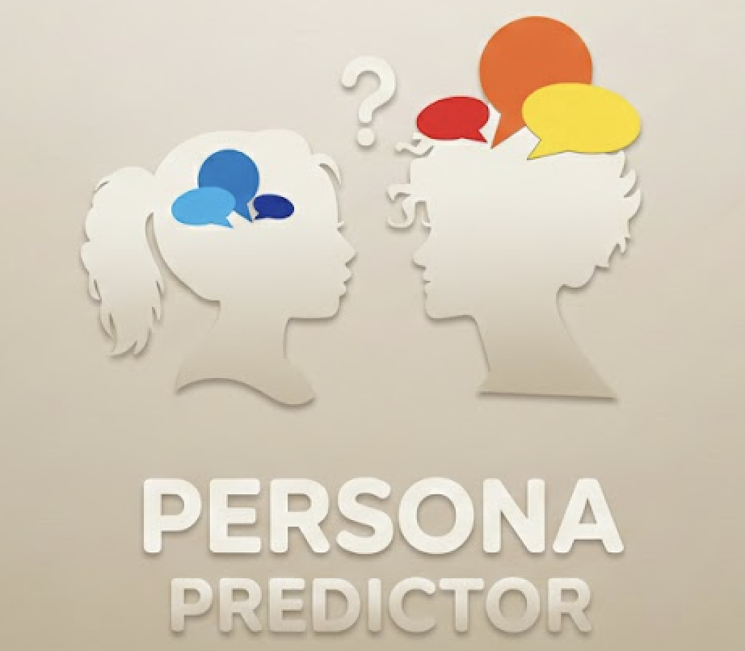

# **Предвидување на карактер со примена на високојазични модели**

## Visual Studio Code проект изработен од: Тамара Стојаноска (231030)

**Факултет:** Факултет за информатички науки и компјутерско инженерство

**Проект по предмет:** Вештачка интелигенција

## Видео: 

https://youtu.be/8eyT8FNPe5E

## Вовед
Проектот **„Предвидување на карактер со примена на високојазични модели“** има за цел да демонстрира како современите јазични модели, познати како **LLM (Large Language Models)**, можат да се применат за анализа и предвидување на човечки карактеристики врз основа на текстуални податоци. Со развојот на вештачката интелигенција и длабокото учење, LLM модели како GPT, BERT и нивните варијанти, се способни да разберат комплексни јазични структури, емоции и стил на изразување, овозможувајќи автоматизирана и интелигентна анализа на текст.
Проектот е развиен со цел да се покаже практична примена на LLM за психологија и анализи на карактерот, комбинирајќи теоретско знаење со современи алатки за машинско учење.

**Слика 1:** Лого

## **Цели на проектот**:
1. Да се изгради систем кој автоматски може да предвиди одредени аспекти на карактерот на личноста врз основа на текстуални податоци. 

2. Да се истражи потенцијалот на **LLM-и за психолошка анализа**. 

3.	Да се развие веб апликација каде корисниците можат да внесат текст и да добијат анализа на карактерот во реално време.

## Технологии и алатки
Проектот користи современи технологии за **развој на веб апликации**:
* **Python 3.13** – примарен програмски јазик за backend логика и машинско учење.
* **Django 6.0** – веб фрејмворк кој обезбедува структуриран и безбеден backend, управување со модели, формулари и административен интерфејс.
* **django-widget-tweaks** – за лесно прилагодување на HTML формуларите и визуелниот изглед.
* **LLM модели (Large Language Models)** – за анализа на текст и предвидување на карактер. Моделот користи NLP техники за конвертирање на текстуални податоци во embeddings, кои се понатаму процесирани за извлекување на психолошки карактеристики.
* **HTML / CSS + Bootstrap 5** – фронтенд компоненти за интерактивна веб апликација.
* **Transformers (Hugging Face)** – AutoTokenizer и AutoModelForSeq2SeqLM  
* **JSON** – формат на податоци за комуникација  

## Архитектура на системот
1. Внес на текст: корисникот го внесува текстот кој сака да се анализира преку веб интерфејс.
   
2. Обработка со LLM: текстот се предава на високоефективен јазичен модел кој извлекува семантички и психолошки карактеристики.

3. Предвидување на карактер: внесениот текст се обработува со **LLM модел** (`google/flan-t5-small`) преку библиотеката **Hugging Face Transformers**. Моделот класифицира личност како **Introvert** или **Extrovert**.  

4. Приказ на резултатите: резултатите се визуелизираат на веб интерфејсот со разни графички и текстуални прикази, овозможувајќи лесно разбирање за корисникот.

## Делот со LLM
Во центарот на проектот се наоѓа **Large Language Model (LLM)** кој ја анализира текстуалната содржина внесена од корисникот. LLM моделот е трениран на големи текстуални корпуси и е способен да разликува контекст, тон на текстот и стил на пишување, како и да извлече психолошки карактеристики на личноста преку NLP embeddings. Овој пристап демонстрира интердисциплинарна примена каде се комбинираат вештачка интелигенција и психологија за автоматизирано предвидување на карактер.

Проектот е реализиран во Django, каде корисникот преку веб форма **(forms.py)** внесува текст кој опишува сопствена личност или начинот на кој се однесува. Формата е едноставна и овозможува внес на повеќередни текстови со ограничување до 2000 знаци.

Во **views.py**, текстот се обработува преку следната логика:
1. Текстот на корисникот се чисти и валидира.
2. Се креира prompt кој содржи инструкции за LLM да класифицира личност како Introvert или Extrovert. Prompt-от исто така содржи примери со текст и очекуван одговор, за да моделот ja разбере структурата на одговорот.
3. Текстот се токенизира преку AutoTokenizer од Transformers библиотеката и се претвора во формат разбирлив за моделот.
4. AutoModelForSeq2SeqLM (flan-t5-small) го генерира предвидувањето, користејќи техники за sampling (top_k, top_p) за варијабилност во одговорите.
5. Генерираниот текст се декодира назад во човечки читлив формат и се прикажува на веб страната (result.html).

Овој процес овозможува интелигентна интерпретација на текстот, далеку над класичните статистички методи кои се базираат на фиксни прашалници или едноставни броевни индикатори. На тој начин, проектот демонстрира како модерните јазични модели можат да се користат за анализа на човечки карактер и предвидување на психолошки особини со висока флексибилност и адаптивност.

## Моделот и причините за избор

За анализа на текстот се користи моделот **google/flan-t5-small** од Transformers библиотеката. Овој модел е дел од T5 семејството и е дополнително fine-tuned на инструкции (FLAN), што значи дека е трениран да следи текстуални упатства и да генерира прецизни одговори според даден контекст.

Причини за избор на FLAN-T5-small:
* Instruction-following capability: моделот може да одговори точно според упатствата дадени во prompt-от.
* Лесен и ефикасен: „small“ верзијата овозможува брза генерација и минимална потрошувачка на ресурси, идеална за прототип и академски проект.
* Seq2Seq архитектура: може да прима текст и да генерира текст, што е погодно за задачи како класификација.
* Баланс помеѓу перформанси и ресурси: Доволно моќен за правилно предвидување на личност, без потреба од големи GPU ресурси.

Генерирањето на текст се контролира со следните параметри:
* **max_new_tokens=100** – Ограничува број на нови токени, доволно за краток одговор.
* **do_sample=True** – Овозможува случајна генерација; истиот текст може да даде малку различни одговори, додавајќи природност.
* **top_k=50** – Ограничува избор на следниот токен на 50 најверојатни, што ја контролира конзистентноста.
* **top_p=0.95** – Nucleus sampling; избира токени од најверојатните кои сочинуваат 95% од вкупната веројатност, овозможувајќи баланс помеѓу креативност и доверливост.
Оваа комбинација на параметри гарантира точност, природност и разноврсност на одговорите, додека генерацијата останува контролирана и лесно разбирлива.

## Prompt инженеринг и избор на стратегија (Few-shot)

Prompt-от е **few-shot**, што значи дека моделот добива инструкции и неколку примери (во мојот случај 4) кои ја покажуваат структурата на текстот и очекуваниот формат на одговорот:

Зошто Few-shot:
1. Моделот FLAN-T5 е instruction-tuned, но few-shot помага да го следи точно форматот на одговорот (Introvert/Extrovert).
2. Без примери (zero-shot), моделот може да произведе текст кој е семантички точен, но не е во очекуваниот формат.
3. Примерите служат како референца, го насочуваат моделот да даде точен и конзистентен одговор.

---

**Важно:** Поради природата на LLM, апликацијата бара серверска средина за работење (Django backend), па не може директно да се хостира на платформи за статични сајтови како GitHub Pages. Од таа причина поставено е видеото во кој е прикажан начинот на кој функционира веб апликацијата.

---

## Споредба на класични ML модели и LLM во предвидување на карактер
Класичните ML модели, како **SVM, Logistic Regression или Random Forest**, кои ги изучувавме во текот на семестарот, бараат текстот да биде **претворен во структурирани карактеристики** преку техники како bag-of-words, TF-IDF или други векторски методи. Овие модели се способни да класифицираат личност врз основа на одредени експлицитни карактеристики, но нивното разбирање на контекстот, емоциите или стилот на пишување е ограничено. Тие обично даваат само класични излези и се високо објасниви преку важност на карактеристиките, но нивната флексибилност за нови задачи е мала – за нов тип класификација обично е потребно ре-тренирање.

Од друга страна, LLM модели, како што е FLAN-T5 користен во проектот, можат директно да обработат суров текст на природен јазик. Тие автоматски извлекуваат семантички и контекстуални информации преку длабоки embeddings и self-attention механизми, овозможувајќи им да разберат сложени контексти, емоции и стил на пишување. 

Дополнително, LLM моделите се флексибилни за нови задачи – доволно е да се промени prompt-от и моделот може да изврши нова класификација без повторно тренирање, користејќи стратегии како few-shot или zero-shot learning. Ова ја зголемува нивната практична применливост за динамични и комплексни задачи во психолошката анализа.

Сумирано, класичните ML модели се поедноставни, побрзи и објасниви, но ограничени во разбирањето на комплексен јазик и контекст, додека LLM моделите обезбедуваат интелигентна, флексибилна анализа на текст, со способност за комплексни интерпретации и директна визуелизација на резултатите на веб апликацијата. Овој пристап ја демонстрира моќта на модерните јазични модели за предвидување.

## Мој поглед и искуство при работа на проектот
Додека работев на проектот за предвидување на човечки карактер со примена на LLM, најголем предизвик за мене беше да најдам модел кој е доволно точен, брз и достапен за прототипирање без финансиски и големи технички ограничувања. Прво пробав со OpenAI GPT-3.5, кој е многу флексибилен и интелигентен, но бесплатната верзија има лимит на повици, што го отежнуваше тестирањето на повеќе сценарија. Исто така, пробав и други модели како BERT, GPT-J и поголеми верзии на FLAN-T5, но кај поголемите модели реалното време на чекање за генерирање на одговор беше премногу долго, што не е практично за веб апликација каде корисникот очекува резултат веднаш.

Инспирацијата за формата на проектот и начинот на кој се детектира карактерот ја црпев од **personality_dataset.csv** кој го пронајдов на Kaggle. Од таму ја добив идејата за тоа како текстот може да се структурира и обработува за да се извлечат психолошки особини, што ми помогна да го дизајнирам prompt-от и логиката на апликацијата.

Дополнително, пробував проектот да го реализирам на македонски јазик, но моделите имаат многу помалку информации за македонски, што доведе до тоа дека често не добивавме посакуван одговор или моделот воопшто не функционираше. Истото се случи и кога пробав да преведувам текст на англиски пред внес во моделот – резултатот не се покажа ефикасен или конзистентен. Поради ова, конечната имплементација беше на англиски, што овозможи моделот да ги даде точните класификации.
На крај, FLAN-T5 се покажа како најдобар компромис – обезбедува доволно точност, структурирани и читливи одговори и при тоа одржува кратко време на чекање, што го прави моделот погоден за реална интеракција со корисникот.

Ме фасцинираше тоа колку малите промени во prompt-от можат значително да го подобрат резултатот. На пример, забележав дека FLAN-T5 со few-shot prompt многу добро следи структурата на одговорот, дава точна класификација и образложение, додека BERT се покажа како ограничен и давајќи одговори (random зборови) кои воопшто не ни беа побарани од него. Со само четири примери во few-shot prompt, моделот успеваше да создаде јасни, читливи и логични одговори, додека без примерите (zero-shot) резултатот понекогаш беше помалку структуриран.
Научив колку е моќно да се комбинира машинско учење со психологија и NLP техники. Беше фасцинантно да гледам како моделот може да извлече психолошки карактеристики од текст и да ги преведе во смислен одговор, нешто што класичните ML модели не можат да го направат со истата природност и креативност.
Процесот на работа ме научи и на значењето на експериментирање и прилагодување на моделот и промтовите, како и на тоа дека дури и со ограничени ресурси (локално хостиран модел) можеш да добиеш впечатливи резултати. Ова искуство ја зголеми мојата љубопитност кон LLM и ме инспирира да размислувам за нивната примена во интердисциплинарни задачи – од образование до креативни индустрии.

## Заклучок
Вештачката интелигенција (AI) претставува гранка на информатиката која се занимава со создавање системи способни да извршуваат задачи кои нормално бараат човечка интелигенција, како што се разбирање на јазик, препознавање на слики, донесување одлуки и учење од искуство. Со развојот на машинско и длабоко учење, AI системите стануваат способни да анализираат големи количини податоци и да прилагодуваат однесување според контекстот.

Со развојот на LLM модели, станува јасно дека иднината на анализа на јазикот и човечката интеракција со машини не е само автоматизација, туку интелигентна интерпретација и разбирање на човечки контекст.  AI се применува во различни области: здравство, образование, финансии, инженерство и така натаму. Со тоа, AI не само што ја зголемува ефикасноста, туку станува вистински асистент кој овозможува нови начини за решавање на комплексни проблеми. Овој проект е пример како можеме да ги искористиме најновите технологии за да создадеме алатки кои се способни да го разберат човечкиот карактер, да обезбедат вредни увиди и да помогнат во образованието, психологијата и пошироко – во секојдневниот живот.

## Користена литература

https://arxiv.org/pdf/2405.10523

https://aclanthology.org/2024.findings-naacl.229.pdf

https://arxiv.org/pdf/2405.13052

https://www.kaggle.com/datasets/timothyadeyemi/personality-dataset

